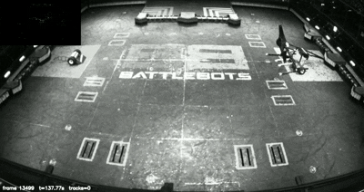

# Nemesis Vision - MOT System

<p align="center">
  
</p>

## Getting Started

1. Clone this repository onto your local machine:
   ```
   git clone git@github.com:AdvancedRoboticCombat/nemesis-tracking.git
   ```

2. `cd` into this project's directory.

3. Create and activate the working environment to install the necessary dependencies/packages:
   ```
   python3 -m venv .venv   #   one-time creation
   source .venv/bin/activate  # Windows: .venv\Scripts\activate
   pip install -U pip setuptools wheel pipdeptree
   pip install -r requirements.txt
   ```

## Future Work


 


