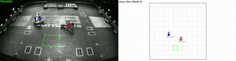
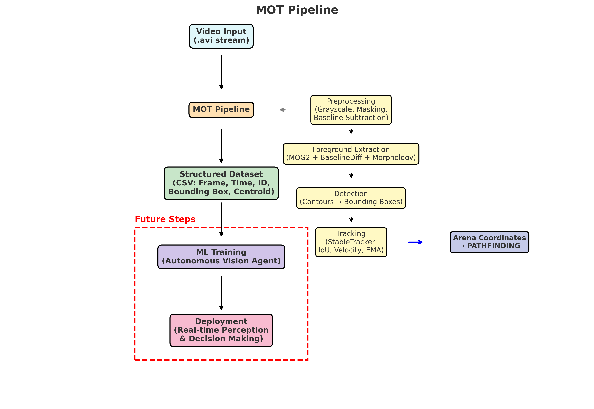

# Nemesis Tracking

Vision tracking system for Nemesis.

<p align="center">
  
</p>

## Usage

Run the main script with a video file and a model:

```bash
python main.py -v <video_path> --model <model_path>
```

### Arguments

| Argument       | Description                                                  |
| :------------- | :----------------------------------------------------------- |
| `--no-diff`    | Don't show the movement tracker.                             |
| `--no-display` | Don't show the GUI.                                          |
| `--stream`     | Set a custom livestream link.                                |
| `--manual`     | Manually init robot positions via clicks (Currently broken). |
| `--yolo-skip`  | Number of frames to skip between running YOLO inference.     |

## File Descriptions

- **`config.py`**: Contains most variables for tuning the program.
- **`display_thread.py`**: Handles visualizations separately from YOLO processing to enable real-time video.
- **`display_view.py`**: Contains logic for the display and GUI elements.
- **`drawing_utils.py`**: Utility functions for drawing on the screen.
- **`homography.py`**: Calculates the approximate real-world position from angled camera footage.
- **`main.py`**: Main entry point combining logic and parameter handling.
- **`timing.py`**: Utility for performance timing and FPS monitoring.
- **`tracker.py`**: Logic for tracking and labeling robots (Needs improvement).

## Issues

- **Real-time Processing**: Processing all information in real-time is challenging due to high frame rates (94fps) and drawing overhead.
  - _Non-livestream solution_: Run YOLO to save data, then display frames using the saved data, dropping frames as needed for smooth playback.
  - _Livestream solution_: Needs a methodical approach as inference cannot be run ahead. Priority is to test with a similar livestream setup.
- **Tracking Accuracy**: Current tracking implementation requires improvement. More accurate physics models or revised assumptions may help.
- **Buffer Synchronization**: Due to the separation of processing, YOLO, and visualization, swapping and manually changing names are currently not functioning correctly.

## Future Work

- Clean up GUI.
- Add more graphs for data analysis.
- Add windows for telemetry data.
- Fix known issues (tracking, buffer sync, etc.).


